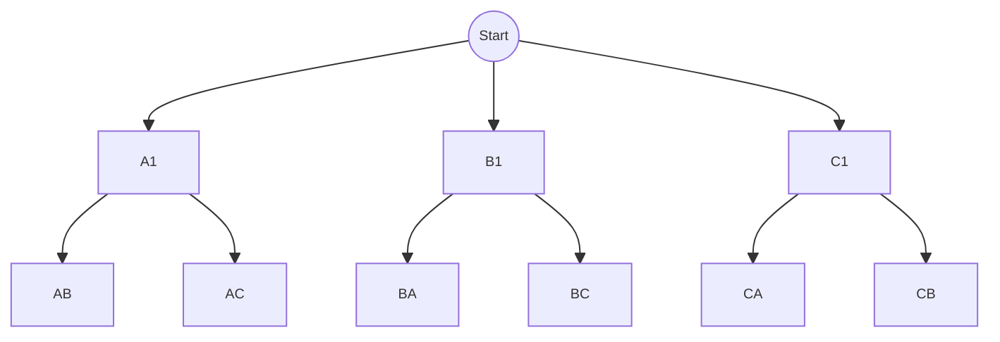

$$\begin{aligned}
\text{Odločevanje v več neodvisnih fazah, v vsaki je }k_{i}\text{ možnosti — vseh možnosti je }k_{1}*k_{2}*....k_{n}
\end{aligned}$$

## Osnovni izrek kombinatorike

### Pravilo produkta
- Kadar je povedano **IN** (npr. 3 juhe in 2 solati)
$$k_{1}*k_{2}*....k_{n}$$

$$\text{Izberemo 1 juho in 1 solato : }\rightarrow3*2=6\text{ možnosti}$$

### Pravilo vsote
- Kadar je povedano **ALI** (npr. 3 juhe ali 2 solati)

$$k_{1}+k_{2}+....k_{n}$$
$$\text{Izberemo 1 juho ali 1 solato : }\rightarrow3\text{ juhe}+2\text{ solati}=5$$

> [!summary] Pregled kombinatorike
> | | Vrstni red šteje | Vrstni red ne šteje |
> |---|---|---|
> | **Brez ponavljanja** | Variacije $V_n^r$ | Kombinacije $C_n^r$ |
> | **Vse elemente** | Permutacije $P_n$ | — |
> | **S ponavljanjem** | $n^r$ | — |

