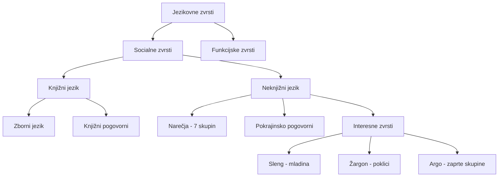

## Kazalo
- [[#1. Sporazumevanje in jezikovne zvrsti]]
- [[#2. Glasoslovje in pravorečje]]
- [[#3. Pravopis]]
- [[#4. Besedoslovje in besedotvorje]]
- [[#5. Pregibne besedne vrste]]
- [[#6. Nepregibne besedne vrste]]
- [[#7. Skladnja in stavčna skladnja]]
- [[#8. Besediloslovje]]
- [[#9. Besedilne vrste in razčlemba besedila]]

---

## 1. Sporazumevanje in jezikovne zvrsti

### Sporazumevanje (komunikacija)
> [!definition] Definicija
> **Sporazumevanje** = izmenjava besedil med ljudmi; obsega **sporočanje** (tvorec) in **sprejemanje** (naslovnik).

- **Enosmerno**: tvorec → naslovnik (govorni nastop, pismo)
- **Dvosmerno**: vlogi se izmenjujeta (pogovor, dopisovanje)

**Besedni jezik** = sestav dogovorjenih besednih znakov + pravil za tvorjenje besedil
**Nebesedni jezik** = mimika, geste, glasnost, slike, tabele ...

**Jezikovni priročniki:**

| Priročnik     | Vsebina                    |
| ------------- | -------------------------- |
| Slovar (SSKJ) | pomeni besed               |
| Slovnica      | pravila za skladanje besed |
| Pravopis (SP) | pravila pisanja            |
| Pravorečje    | pravila izgovorjave        |

> [!tip] Dostop
> Vsi priročniki so dostopni na **www.fran.si**

---

### Jezikovne zvrsti

Drevo jezikovnih zvrsti

**Socialne zvrsti** – prostorsko in družbeno pogojene:

| Zvrst | Opis | Primer |
|---|---|---|
| **Zborni jezik** | stroga, pisna oblika | knjige, nastopi |
| **Knjižni pogovorni** | sproščena oblika | pogovor s tujcem |
| **Narečje** | geografsko omejeno (~50 v 7 skupinah) | primorsko, koroško... |
| **Pokrajinsko pogovorni** | večje pokrajine | ljubljanščina, mariborščina |
| **Sleng** | govorica mladih | "cimer", "fejst" |
| **Žargon** | poklicna govorica | zdravniški, pravniški |
| **Argo** | skrivni jezik zaprtih skupin | papajščina, latovščina |

> [!note] 7 narečnih skupin
> primorsko · koroško · dolenjsko · štajersko · rovtarsko · gorenjsko · panonsko

**Funkcijske zvrsti** – glede na namen besedila:
- **Praktično sporazumevalni** – vsakdanje sporazumevanje
- **Strokovni** – znanstveni in strokovni jezik, terminologija
- **Publicistični** – množična občila (časopisi, TV, radio)
- **Umetnostni** – lirika, epika, dramatika; estetski učinek

**Prinosniške zvrsti:**
- **Govorno** besedilo (izgovorjeno)
- **Pisno** besedilo (zapisano)

---

### Vrste pogovorov

| Vrsta | Namen | Značilnost |
|---|---|---|
| **Povezovalni** | navezovanje stika | pozdrav, voščilo |
| **Raziskovalni** | pridobivanje informacij | vprašanje → odgovor |
| **Prepričevalni** | prepričevanje | trditev + argumenti |
| **Pogajalni** | iskanje kompromisa | popuščanje obeh strani |

> [!example] Razlika prepričevalni vs. pogajalni
> - Prepričevalni: ZA ali PROTI (eden zmaga)
> - Pogajalni: srednja pot, kompromis

---

## 2. Glasoslovje in pravorečje

> [!definition] Glasoslovje (fonetika)
> Nauk o glasovih – preučuje izražanje in podobo jezika.

### Glasovi slovenščine

**Samoglasniki (vokali):** `i, u, e (ozki/široki), o (ozki/široki), a, polglasnik (ə)`

**Soglasniki:**
- **Zvočniki:** m, n, r, l, j, v
- **Nezvočniki nezveneči:** p, f, t, s, š, č, c, k, h
- **Nezvočniki zveneči:** b, v, d, z, ž, dž, g

> [!warning] Pisava ≠ Izgovor
> Slovenščina ima **8 samoglasnikov**, piše pa jih z **5 črkami**!
> - i → dolgi (ozki) ali kratki (široki)
> - e → ozki (led) ali široki (žena)
> - o → ozki (goba) ali široki (noga)

### Naglasna znamenja
| Znamenje | Pomen | Primer |
|---|---|---|
| Strešica ê | dolg, širok | žênа |
| Ostrivec é | dolg, ozek | léd |
| Krativec è | kratek | bèk |

### Glasovne premene

**Zvočniki – pišemo obliko pred samoglasnikom:**
- konji (nj) → konj (n)
- na lovu (v) → lov, lovski (u)
- brala (l) → bral → bralci (u)

**Nezvočniki – pišemo obliko pred samoglasnikom ali zvočnikom:**
- medvedi (d) → medved (t)
- moža (ž) → mož (š)

> [!tip] Pravilo za dvojne soglasnike
> Na morfemskem šivu pišemo OBA soglasnika:
> - oddih, razžagati, petdeset

### Pravorečje
- Nauk o **pravilni izgovarjavi** besed, stavkov, povedi
- Vključuje: izgovor glasov, naglaševanje, glasnost, hitrost, premori

---

## 3. Pravopis

> [!definition]
> **Pravopis** = pravila pravilnega pisanja besed, stavkov in besedil.

### Velika začetnica

**Pišemo z veliko:**
- Prva sestavina lastnega imena: *Orlovo pero, Slovenska matica*
- Kadar je 2. sestavina samostalnik (mesto, vas, trg): *Novo mesto, Nova vas*
- Kadar je 1. sestavina predlog: *Log pod Mangartom, Šmarje pri Jelšah*
- Lastna imena: osebe (Janez), kraji (Triglav), institucije (Duma)

**Pišemo z malo:**
- Občna (splošna) poimenovanja: *otrok, moka, mladost*

### Ločila

#### Končna ločila
| Ločilo | Raba | Intonacija |
|---|---|---|
| . pika | pripovedna poved | padajoča |
| ? vprašaj | vprašalna poved | naraščajoča |
| ! klicaj | vzklikna, velelna, želelna | povišan glas |

**Nekončna ločila:**
- , vejica – melodija povedi, olajšuje branje
- : dvopičje – napoveduje naštevanje
- ; podpičje – med enakovrednimi deli

#### Vejica – kdaj JE?

> [!note] Priredja Z vejico
> Protivno (a, toda, vendar), Vzročno (kajti, saj, sicer), Sklepalno (torej, zato), Pojasnjevalno (namreč, in sicer), Stopnjevalno (ne samo … ampak)

> [!warning] Priredja BREZ vejice
> Vezalno (in, ter, pa), Stopnjevalno (ne-ne, niti-niti), Ločno (ali-ali)

**Vejica je VEDNO** pred: ki, ko, ker, da, če, čeprav (podredni vezniki)

### Pisanje skupaj / narazen
- Predlogi stojijo **pred** besedo, na katero se nanašajo
- Sestavljenke: škofjeloški ✓, škofje loški ✗
- Prevzete besede: pica/pizza ✓

### Prevzete besede
| Vrsta | Opis | Primer |
|---|---|---|
| **Sposojenke** | popolnoma prilagojene | hiša, gol, garaža |
| **Tujke** | delno prilagojene | intermezzo, joule |
| **Citatne besede** | tujejezični navedki | "mon cher ami" |
| **Domače ustreznice** | zamenjava za tujko | svetilka (lampa), pogum (korajža) |

---

## 4. Besedoslovje in besedotvorje

### Besedoslovje

> [!definition]
> **Besedoslovje** = nauk o besedi; pojasnjuje zgradbo in vrsto besede.

**Pomenski odnosi med besedami:**

| Pojem | Opis | Primer |
|---|---|---|
| **Enopomenska** | en pomen | glagol, sonet, romboid |
| **Večpomenska** | osnovni + preneseni pomen | buča (na njivi) → buča vina |
| **Sopomenke** | isti pomen, drugačen zapis | coprnica = čarovnica |
| **Protipomenke** | nasprotni pomen | veselje ↔ žalost |
| **Nadpomenka** | širši pomen | čustvo (↑ veselje) |
| **Podpomenka** | ožji pomen | vrabec (↓ ptica) |
| **Blizuzvočnice** | podoben zvok, drug pomen | kura – kokoš; kura – dieta |

**Stalne besedne zveze (frazemi):**
- V prosti zvezi lahko zamenjamo besedo s sopomenko
- V stalni zvezi tega NE moremo: *meče polena pod noge* = ovira

**Slogovna zaznamovanost:**
- **Slogovno zaznamovane**: čustveno obarvane (ljubkovalne/slabšalne), zborne, slengovski izrazi
- **Slogovno nezaznamovane**: strokovni izrazi, nevtralne besede
- **Časovna zaznamovanost**: starinske / nove / nezaznamovane

---

### Besedotvorje

> [!definition]
> **Besedotvorje** = nauk o tvorbi novih besed.

**Sestavni deli tvorjenke:**

    podstava + obrazilo = tvorjenka
      kup   +   ec    = kupec
      zob-zdravnik (zlaganje)

**Obrazila:**
- **Levo (predpona):** po-mlad, so-potnik
- **Desno (pripona):** mlad-ost, kuž-ek
- **Medpona:** avt-o-bus

#### Besedotvorni načini

| Način | Opis | Primer |
|---|---|---|
| **Izpeljevanje** | enobesedna podstava + desno obrazilo | kuž + ek = kužek |
| **Sestavljanje** | enobesedna podstava + levo obrazilo | so + potnik = sopotnik |
| **Zlaganje** | večbesedna podstava + vmesni samoglasnik | zbor-o-vodja |
| **Skloplanje** | večbesedna podstava, strnjena brez vmesnega samoglasnika | karseda, pedenjped |
| **Krnitev** | odvzem glasov/zlogov | TOSAMA, Branko |
| **Konverzija** | premik besede med besednimi vrstami | dežurni (pridev.) → dežurni (sam.) |

> [!example] Mešane tvorbe
> - Krnitev + sklaplanje: OZN (Organizacija Združenih Narodov)
> - Krnitev + izpeljava: Stanko (Stan + ko)

**Besedna družina** = skupina besed z istim korenom:
> mlad → pomlad, mladost, mlaj, premlad, mladina

---

## 5. Pregibne besedne vrste

> [!definition]
> **Pregibne besedne vrste** = besedne vrste, ki se **sklanjajo ali spregajo** (menjajo obliko).
> To so: **samostalnik, pridevnik, zaimek, števnik, glagol**

---

### 5.1 Samostalnik

**Imenuje:** osebe, živali, rastline, stvari, pojme.

**Vrste:**
- **Lastna** (z veliko): Janez, Triglav, Merkur
- **Občna** (z malo):
  - Števna: miza (ena, dve, pet miz)
  - Neštevna: snovna (moka, olje), skupna (listje, srnjad), pojmovna (lepota, ljubezen)

**Slovnične kategorije samostalnika:**

| Kategorija | Vrednosti |
|---|---|
| **Spol** | moški (tisti), ženski (tista), srednji (tisto) |
| **Število** | ednina, dvojina, množina |
| **Sklon** | 6 sklonov |
| **Sklanjatev** | moška (1-4), ženska (1-4), srednja (1-4) |

**Skloni:**

    Im. – Kdo ali Kaj (je)?
    Rod. – Koga ali Česa (ni)?
    Daj. – Komu ali Čemu (dam)?
    Tož. – Koga ali Kaj (vidim)?
    Mest. – Pri kom ali čem (stojim)?
    Or.  – S kom ali čim (hodim)?

**Sklanjatve:**

| Spol | Sklanjatev | Primer |
|---|---|---|
| Moška 1. | Im. -Ø, Rod. -a | korak, koraka |
| Moška 2. | Im. -a, Rod. -e | Luka, Luke |
| Ženska 1. | Im. -a, Rod. -e | mama, mame |
| Ženska 2. | Im. -Ø, Rod. -i | kost, kosti |
| Srednja 1. | Im. -o/-e, Rod. -a | sonce, sonca |

---

### 5.2 Pridevnik

**Zaznamuje:** lastnost, vrsto, svojino samostalnika.

| Vrsta          | Vprašanje | Primer           |
| -------------- | --------- | ---------------- |
| **Lastnostni** | Kakšen?   | lep, hiter       |
| **Vrstilni**   | Kateri?   | železni, šolski  |
| **Svojilni**   | Čigav?    | mamičin, Janezov |

**Stopnjevanje:**

| Stopnja   | Končniško | Opisno    |
| --------- | --------- | --------- |
| Osnovnik  | lep       | dober     |
| Primernik | lepši     | boljši    |
| Presežnik | najlepši  | najboljši |

**Določna/Nedoločna oblika** (samo pri m. sp. v Im.):
- Določna → končnica **-i** (npr. *dežurni*)
- Nedoločna → brez -i (npr. *lep fant*)

---

### 5.3 Zaimki

#### Samostalniški zaimki (nadomeščajo samostalnik)

| Vrsta           | Primeri                      |
| --------------- | ---------------------------- |
| Osebni          | jaz, ti, on/ona; mi, vi, oni |
| Povratno osebni | sebe, sebi, seboj            |
| Vprašalni       | kdo, kaj                     |
| Oziralni        | kdor, kar                    |
| Nedoločni       | nekdo, nekaj                 |
| Nikalni         | nihče, nič                   |

#### Pridevniški zaimki (nadomeščajo pridevnik)

| Vrsta | Kakovostni | Svojilni | Vrstni | Količinski |
|---|---|---|---|---|
| Vprašalni | kakšen | čigav | kateri | koliko |
| Kazalni | takšen | od tega | ta/tisti | toliko |
| Oziralni | kakršen | katerega | ki/kateri | kolikor |
| Nedoločni | nekakšen | od nekoga | neki | nekateri |
| Nikalni | nikakršen | nikogar | nobeden | nič |
| Celostni | vsakršen | vsakogar | vsak | ves |
| Povrn.-svojilni | – | moj/tvoj/njegov | – | – |

---

### 5.4 Števnik

**Vprašanje:** Koliko? Kateri (po vrstnem redu)?

| Vrsta | Opis | Primer |
|---|---|---|
| **Glavni** | Številčna enota | ena, dve, pet |
| **Vrstilni** | Zaporedna enota | 1., 2., 3. |
| **Ločilni** | Ločuje vrste | dvoje jabolk |
| **Množilni** | Plasti | trojno dno |
| **Nedoločni** | Nenatančna količina | več, malo, manj |

---

### 5.5 Glagol

**Zaznamuje:** dogajanje, dejanje, stanje, spremembo.
**Vprašanje:** Kaj kdo dela? Kaj se z njim dogaja?

**Oblikoslovne kategorije glagola:**

| Kategorija | Vrednosti |
|---|---|
| **Oseba** | 1., 2., 3. |
| **Število** | ednina, dvojina, množina |
| **Čas** | sedanjik, preteklik, prihodnjik, predpreteklik |
| **Naklon** | povedni, velelni, pogojni |
| **Vid** | dovršni (zaključeno), nedovršni (traja) |
| **Način** | tvornik (aktiv), trpnik (pasiv) |
| **Prehodnost** | prehodni / neprehodni |

**Spreganje (delam):**

    Ednina:  delam / delaš / dela
    Dvojina: delava / delata / delata
    Množina: delamo / delate / delajo

**Časi:**
- Sedanjik: *delam*
- Preteklik: *sem delal*
- Prihodnjik: *bom delal*
- Predpreteklik: *sem bil delal*

**Naklon:**
- Povedni: *delam*
- Velelni: *delaj!* (samo sedanjik)
- Pogojni sedanjik: *bi delal* / preteklik: *bi bil delal*

#### Neosebne glagolske oblike

> [!warning] Nedoločnik vs. Namenilnik
> - **Nedoločnik** (-ti, -i): po VSEH glagolih RAZEN glagolov premikanja → *moram pospravljati*
> - **Namenilnik** (brez -i): po glagolih premikanja (grem, tečem, letim) → *grem nabirati gobe* → *grem nabrat gobe*

**Deležniki:**
- Na **-l** (opisni): *sem videl, bom bral*
- Na **-n/-t** (trpni): *popravljen, zapit*
- Na **-č** (kakšen?): *pojoč fant, deroča voda*

**Deležja:**
- Na **-č**: *Pojoč je korakal.*
- Na **-aje**: *Igraje so pozabili.*
- Na **-e**: *Molče ji je prisluhnil.*
- Na **-ši/-vši**: *Prišedši je pozdravil.*

---

## 6. Nepregibne besedne vrste

> [!definition]
> **Nepregibne besedne vrste** = ne menjajo oblike; so: **prislov, predlog, veznik, členek, medmet**

---

### 6.1 Prislov

**Je enobesedni odgovor na okoliščinsko vprašanje.**

| Vrsta | Vprašanje | Primeri |
|---|---|---|
| Krajevni | Kam? Kje? Kod? | doma, tja, tam |
| Časovni | Kdaj? | zvečer, pozno, jutri |
| Načinovni | Kako? | hitro, tiho |
| Vzročni | Zakaj? | zato, zaman |

Stopnjevanje: *hitro → bolj hitro → najbolj hitro*

---

### 6.2 Predlog

**Funkcija:** določa sklon samostalniške besede.

**Primeri:** s, z, k, h, pri, ob, na, v, pred, za, pod, nad, skozi, iz, do ...

> [!tip] Predloga S/Z in H/K
> - **S**: pred š, k → s šolo, s kom
> - **Z**: pred t, s, h, c, p, č → z mizo
> - **H**: pred k, g → h kraju, h gradu
> - **K**: pred vsemi ostalimi → k mami

---

### 6.3 Veznik

**Veže besede ali stavke.**

| Vrsta | Vezniki | Vejica |
|---|---|---|
| **Vezalni** | in, ter, pa | ❌ ni |
| **Stopnjevalni** | ne-ne, niti-niti, ne samo–ampak | ❌ ni |
| **Ločni** | ali-ali, ali | ❌ ni |
| **Vzročni** | kajti, saj, sicer, zakaj | ❌ ni |
| **Protivni** | a, toda, vendar, temveč, ampak | ✅ je |
| **Pojasnjevalni** | in sicer, to je, namreč | ✅ je |
| **Sklepalni** | torej, zato, zatorej | ✅ je |

**Podredni vezniki** (vejica je VEDNO): ki, ko, ker, da, če, čeprav, kar, kdor

---

### 6.4 Členek

**Spreminja pomenski odtenek povedi.**
- Primeri: *tudi, samo, le, menda, mogoče, prav*
- Pritrjevalni: **da**
- Nikalni: **ne**

---

### 6.5 Medmet

**Vrste:**
- Čustveni: *oh, ah, av*
- Posnemovalni: *hov-hov, smuk*
- Velelni: *marš, pozor*

---

## 7. Skladnja in stavčna skladnja

> [!definition]
> **Skladnja** = jezikovna ravnina, ki se ukvarja z razvrščanjem besed v stavke in stavkov v povedi.

---

### Poved in stavek

**POVED** = najmanjša samostojna enota sporočila; konča se s končnim ločilom.

**Vrste povedi po naklonu:**
- Pripovedna (.)
- Vprašalna (?)
- Velelna (!)
- Želelna (!)
- Vzklikna (!)

**STAVEK** = besede zbrane okoli ene glagolske oblike.

---

### Stavčni členi

| Stavčni člen | Vprašanje | Podčrtamo | Primer |
|---|---|---|---|
| **Osebek** | Kdo ali kaj je? | ravna črta ___ | *Ana bere.* |
| **Povedek** | Kaj kdo dela? | kriva črta ~~~ | *Ana **bere**.* |
| **Predmet** | Koga/česa/komu... | dvojna ravna === | *Kupil sem **knjigo**.* |
| **Pris. določilo** | Kdaj/kje/kako/zakaj... | poševnice /// | *Bere **hitro**.* |
| **Prilastek** | Kakšen/kateri/čigav? | pikice ...... | *Lepa **Ana** bere.* |
| **Povedkovo določilo** | Kdo ali kaj (biti+)? | črtice - - - | *Ana je **učiteljica**.* |

**Prislovna določila:**
- Kraja (kje, kam, kod)
- Časa (kdaj)
- Načina (kako)
- Vzroka (zakaj)
- Namena (čemu)
- Pogoja
- Dopustitve

---

### Večstavčna poved

#### Priredje (enakovredni stavki)

| Vrsta | Vezniki | Vejica |
|---|---|---|
| Vezalno | in, ter, pa | ❌ |
| Stopnjevalno | niti-niti, ne samo–ampak | ❌ |
| Ločno | ali-ali | ❌ |
| Vzročno | kajti, saj, sicer | ❌ |
| Protivno | a, toda, vendar, ampak | ✅ |
| Pojasnjevalno | namreč, in sicer, to je | ✅ |
| Sklepalno | torej, zato, zatorej | ✅ |

#### Podredje (glavni + odvisni stavek)

> [!note] Vejica je VEDNO v podredju!

**Vrste odvisnikov:**

| Vrsta | Vprašanje | Vezniki |
|---|---|---|
| **Osebkov** | Kdo/kaj? | kdor, kar, da, če |
| **Predmetni** | Koga/kaj/komu...? | da, če, kako, koliko |
| **Krajevni** | Kje/kam/kod? | kjer, kamor, koder |
| **Časovni** | Kdaj? | ko, kadar, dokler, medtem ko |
| **Vzročni** | Zakaj? | ker, ko |
| **Namerni** | Čemu? | da |
| **Pogojni** | Pod kakšnim pogojem? | če, ako |
| **Dopustni** | Kljub čemu? | čeprav, četudi, dasi |
| **Načinovni** | Kako? | kot, kakor, ne da |
| **Prilastkov** | Kakšen/kateri? | ki, kateri |

---

### Premi in odvisni govor

**Premi govor** = dobesedni navedek v narekovaju + spremni stavek
> "Končno si le prišel," je zagodrnjal Peter.

**Pretvorba v odvisni govor:**
- Odstranim narekovaje
- Dodam veznik da
- Zamenjam osebo in čas glagolov
> Peter je zagodrnjal, da je končno le prišel.

---

### Besedni red

- **Nevtralni**: osebek → povedek → predmet/določila
- **Slogovno zaznamovani** (inverzija): obrnjen vrstni red → čustveni poudarek
- Naslonke: za prvim stavčnim členom
- Predlogi: pred svojo besedo
- Členki: pred poudarjenim delom

---

## 8. Besediloslovje

> [!definition]
> **Besediloslovje** = nauk o besedilih; preučuje zgradbo, vrste in lastnosti besedil.

### Lastnosti besedila

| Lastnost | Razlaga |
|---|---|
| **Tematska enotnost** | besedilo govori o eni temi |
| **Koherenca** | vsebinska povezanost (logična) |
| **Kohezija** | jezikovna povezanost (zamenjava z zaimki, ponavljanje) |
| **Informativnost** | sporočilna vrednost |
| **Situativnost** | umestitev v sporazumevalno situacijo |
| **Namernost** | tvorec ima namen |
| **Sprejemljivost** | naslovnik besedilo sprejme |

### Sporazumevalna situacija
- **Tvorec/sporočevalec** – kdo piše/govori
- **Naslovnik/prejemnik** – kdo bere/posluša
- **Tema** – o čem
- **Namen** – zakaj
- **Prenosnik** – kako (pisno/ustno)
- **Kraj in čas** – kdaj in kje

### Vrste besedil po funkciji

| Vrsta | Namen | Primeri |
|---|---|---|
| **Pripovedovalno** | pripoveduje o dogodkih | zgodba, poročilo |
| **Opisovalno** | opisuje lastnosti | opis osebe/naprave |
| **Razlagalno** | razlaga pojave | učbenik, enciklopedija |
| **Utemeljevalno** | utemeljuje mnenje | ocena, esej |
| **Pozivno** | poziva k dejanju | oglas, prošnja, vabilo |

---

## 9. Besedilne vrste in razčlemba besedila

### Uradovalna besedila

> [!note] Splošna oblika uradnega besedila

    NASLOV POŠILJATELJA (levo zgoraj)
    KRAJ IN DATUM (desno zgoraj)
    NASLOV PREJEMNIKA (levo pod pošiljateljem)
    NASLOV BESEDILA (sredina)
    NAGOVOR: Spoštovani!
    VSEBINA
    POZDRAV
    PODPIS (desno spodaj)
    PRILOGE (levo spodaj)

| Besedilna vrsta | Bistvo |
|---|---|
| **Vabilo** | vabi na prireditev; navede kraj, čas, dnevni red |
| **Zahvala** | izraža hvaležnost za storjeno dejanje |
| **Opravičilo** | obžalovanje za ravnanje, ki je škodovalo naslovniku |
| **Izjava** | zagotavlja resničnost podatkov; podpis = jamstvo |
| **Prošnja** | želi pridobiti korist; utemeljitev + dokazila |
| **Prijava** | odziv na razpis; sklicuje se na razpis |
| **Pritožba** | odziv na neprimerno ravnanje; reklamacija |
| **Potrdilo** | potrjuje prejeto ali opravljeno; žig + podpis |
| **Pooblastilo** | pooblašča drugo osebo za zastopanje |
| **Obvestilo** | naznanja javnosti pomemben dogodek |

---

### Publicistična besedila

| Vrsta | Bistvo | Značilnosti |
|---|---|---|
| **Novica** | kratko obvestilo o aktualnem dogodku | Kdo? Kdaj? Kje? Kaj? + privlačen naslov |
| **Poročilo** | potek aktualnega dogodka | rezultat najprej, nato potek; preteklik |
| **Intervju** | dvogovorni pogovor z znano osebo | vprašanja = max 10%, osebnostni/tematski |
| **Reportaža** | osebno obarvano pripovedovalno besedilo | uvod + zaplet + razplet; bližina leposlovju |
| **Ocena** | vrednotenje umetniškega/strokovnega dela | splošni podatki + vrednotenje + zaključek |

---

### Predstavitvena besedila

| Vrsta | Bistvo |
|---|---|
| **Opis osebe** | zunanjost + oznaka + pripoved o življenju; sedanjik |
| **Opis kraja** | upravni status, lega, zgodovina; objektivno/subjektivno |
| **Opis naprave** | deli + delovanje; sedanjik brezčasnosti |
| **Opis postopka** | koraki v zaporedju; 1. os. mn. ali velelnik |
| **Življenjepis** | podatki v časovnem zaporedju; preteklik; 1. os. ali 3. os. |
| **Zapisnik** | glava + dnevni red + sklepi + zaključek; uradna listina |

---

### Razčlemba besedila

> [!tip] Postopek razčlembe
> 1. **Zunanja zgradba**: naslovi, odstavki, grafične prvine
> 2. **Notranja zgradba**: uvod – jedro – zaključek
> 3. **Sporazumevalna situacija**: kdo, komu, kdaj, zakaj, kako
> 4. **Tema in namen besedila**
> 5. **Besedilna vrsta**: katero in zakaj
> 6. **Jezikovna analiza**: besedne vrste, stavčni členi, jezikovne zvrsti
> 7. **Slogovna zaznamovanost**: nevtralno/zaznamovano

**Kazalci besedilne vrste:**
- Glagolski čas (sedanjik = splošnost; preteklik = pretekli dogodek)
- Oseba (1. os. = osebno; 3. os. = objektivno)
- Prevlada opisnih / pripovednih / razlagalnih prvin
- Značilno besedišče in struktura

---

> [!summary] Hitri pregled besednih vrst
> | Vrsta | Pregibna? | Vprašanje |
> |---|---|---|
> | Samostalnik | ✅ | Kdo/kaj? |
> | Pridevnik | ✅ | Kakšen/kateri/čigav? |
> | Zaimek | ✅ | (nadomešča sam. ali prid.) |
> | Števnik | ✅ | Koliko? |
> | Glagol | ✅ | Kaj dela? |
> | Prislov | ❌ | Kdaj/kje/kako/zakaj? |
> | Predlog | ❌ | (določa sklon) |
> | Veznik | ❌ | (veže besede/stavke) |
> | Členek | ❌ | (odtenek povedi) |
> | Medmet | ❌ | (čustvo/posnemanje) |
